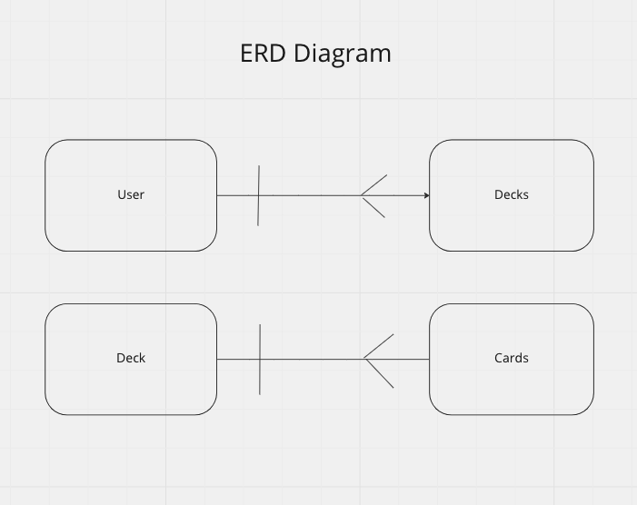

Arkham Horror LCG Deck Builder
================

This application will help create and maintain Arkham Horror LCG decks. Each user will have their own decks and can edit them accordingly. 

## Technology Used

The following tehnology was used to create this version of Minesweeper

- Javascript
- CSS
- HTML
- MongoDB
- Express
- CORS

## Getting Started

Create an account and add your first deck. Use the search bar on the left side to add specific cards using your newly made deck's ID. 

Here is the application. 
https://standarddemacian.github.io/Arkham-Horror-Deck-Builder-Client/

## Routes Table

|      Name      | Path              | Verb   | Description                   |   |
|:--------------:|-------------------|--------|-------------------------------|---|
| indexDeck      | /deck             | GET    | Pulls all the decks           |   |
| showDeck       | /deck/:id         | GET    | shows a deck based on ID      |   |
| createDeck     | /deck             | POST   | Creates a new deck            |   |
| upDateDeck     | /deck/:id         | PATCH  | Updates a deck by its ID      |   |
| addCard        | /deck/addcard/:id | PATCH  | Adds a card to the card field |   |
| deleteDeck     | /deck/:id         | DELETE | Deletes a deck                |   |
| signUp         | /sign-up          | POST   | Makes a user                  |   |
| signIn         | /sign-in          | POST   | Logs user in                  |   |
| showCardByName | /card/:name       | GET    | Gets a single card by name    |   |
| showCardById   | /card/id/:id      | GET    | Gets a single card by ID      |   |